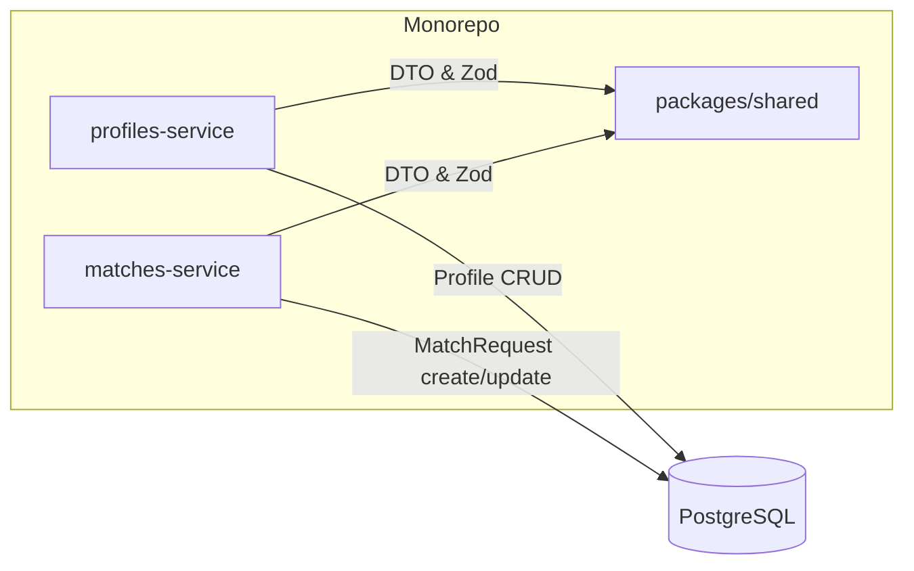

# Архітектура

## Огляд

Проєкт побудований як monorepo, що містить два HTTP-сервіси та спільний пакет з DTO/валідацією.

- `apps/profiles-service` — сервіс профілів
- `apps/matches-service` — сервіс матчів
- `packages/shared` — спільні DTO, Zod-схеми, утиліти валідації

## Розподіл відповідальності

### Profiles Service

Призначення: керування профілями (створення та читання).

Рекомендовані шари:

- **Routes/Controller** — маршрути, парсинг/валідація запиту, формування відповіді
- **Service** — бізнес-логіка
- **Repository** — доступ до даних (на Lab 3 може бути in-memory; на Lab 4+ — Prisma/PostgreSQL)

### Matches Service

Призначення: керування матч-запитами (request → accept/reject).

Рекомендовані шари:

- **Routes/Controller**
- **Service**
- **Repository**

## Спільні модулі

### packages/shared

Містить:

- DTO (типи/інтерфейси)
- Zod-схеми для валідації body/query/params
- функцію `validateBody(schema)` (або аналог), яку можна перевикористати в обох сервісах

## Компонентна діаграма (Mermaid)

