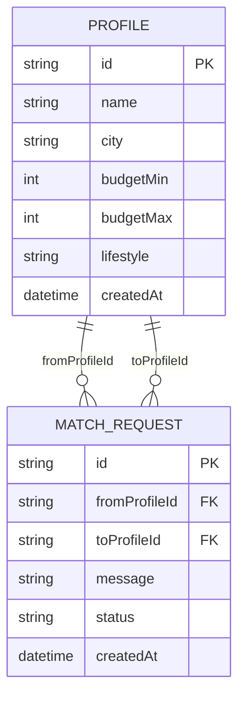

# Модель даних

## Сутності

### Profile

- `id` (UUID) — PK
- `name` (string)
- `city` (string)
- `budgetMin` (int)
- `budgetMax` (int)
- `lifestyle` (string або enum)
- `createdAt` (datetime)

### MatchRequest

- `id` (UUID) — PK
- `fromProfileId` (UUID) — FK → Profile.id
- `toProfileId` (UUID) — FK → Profile.id
- `message` (string, optional)
- `status` (enum: `PENDING | ACCEPTED | REJECTED`)
- `createdAt` (datetime)

## Обмеження та правила

- `fromProfileId != toProfileId`
- `fromProfileId` та `toProfileId` повинні посилатися на існуючі профілі
- Зміна статусу можлива тільки на допустимі значення enum

## ER-діаграма (Mermaid)

> Примітка: у Mermaid `erDiagram` enum можна позначати як `string status` + опис у тексті або винести окремою секцією документа.
